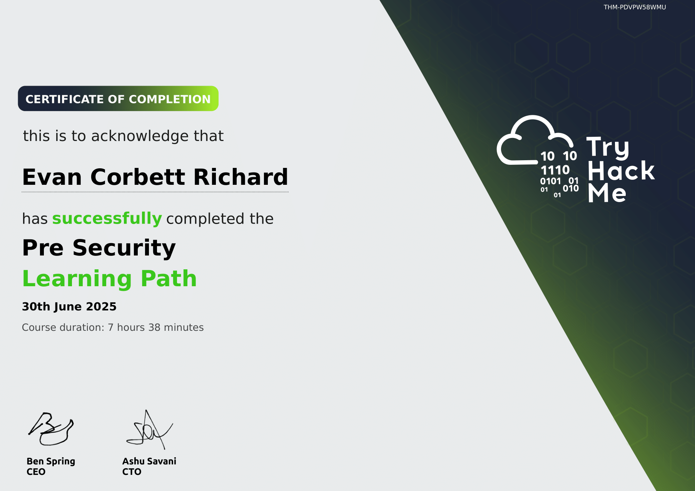
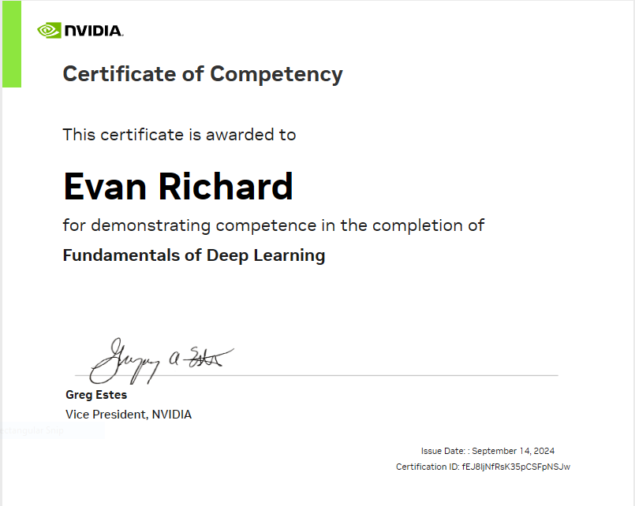

<!-- PULL BEFORE MAKING CHANGES BECAUSE OF GITHUB ACTION ADDED TO TAKE CARE OF TRYHACK ME BADGE -->
## Hello! My name is Evan Richard 👋
*** 
<!-- LANGUAGES -->

    
    
     
    
    
    
    
    

    
***
<!-- TOOLS -->

    
    
    
    
    
    
    
    
    

 

***
<!-- BADGES/STATS -->

    
    
    
    
    
    
    
    
    
    

***
<!-- CERTIFICATIONS -->

    
    
    

***

### About **Me** 🙋‍♂️

I'm a computer science undergraduate at Missouri Science and Technology in Rolla Missouri. My area's of interest include **Cybersecurity** 🔒 and **Web Development** 🕸️. I love programming, but outside of building a career for myself I can also be found **fishing** 🐟, **bowling** 🎳, **gaming** 👾, **reading** 📚, **lifting** 💪, and **hanging with friends** 😎.

***
### Current Projects

On top of my studies, I'm currently working on several different things but my main project right now is a website built with **HTML**, **JAVASCRIPT**, and **CSS** to improve my web development skills. With this I am also working on Cybersecurity by performing labs on an online learning website called **CyberDefenders** to get real experience using **OSINT**, various security libraries like **Volatility3** , and real world security software like **Wireshark**. All of this to say I'm also practicing my **Python** and algorithm skills with **Neetcode** and by working with the **Multirotor Design Team** on **Inter-Drone Communication**. Finally, I'm continuing to learn more of the fundementals of security with **Tryhackme's SOC Track** and studying to complete my **CompTIA A+ Certification**. 

_(Images below link to above from left -> right: Website, Cyberdefenders, Neetcode, Tryhackme)_

    <!-- Personal Website -->
    
    <!-- Cyberdefenders -->
    
    <!-- Neetcode -->
    
    <!-- Tryhackme -->
    

***

    <h1> Connect With Me! 👉 
        
    </h1>
    

